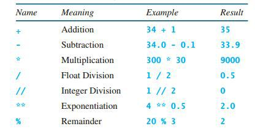
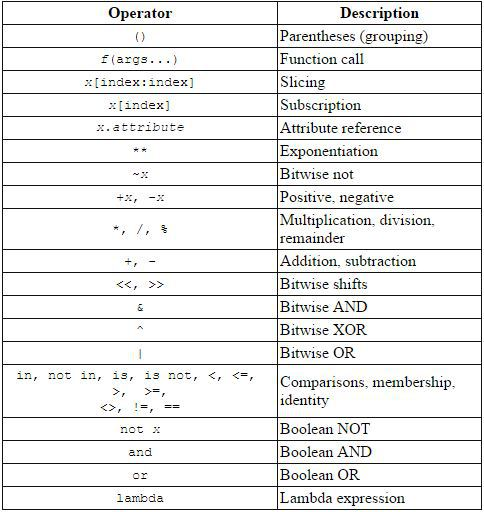
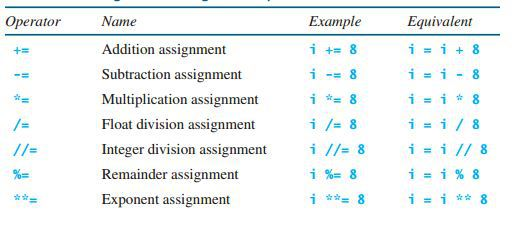

# Python numbers
Python3 support 3 different numerical types.

1. *int* – for integer values like **45**
2. *float* – for floating point values like **2.3**
3. *complex* – for complex numbers like **3+2j**

### Python operators

### Operator Precedence

### Augmented Assignment Operator
