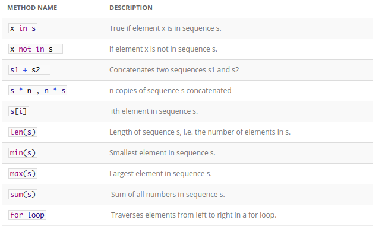

# Python Lists

### Creating a list
```python3
list0 = [0, 1, 2, 3]

list1 = ["this is a string", 12]

list2 = list() # Create an empty list

list3 = list([22, 31, 61]) # Create a list with elements 22, 31, 61

list4 = list(["tom", "jerry", "spyke"]) # Create a list with strings

list5 = list("python") # Create a list with characters p, y, t, h, o, n
```

### List Common Operations


### List slicing
```python3
>>> list = [11,33,44,66,788,1]
>>> list[0:5] # this will return list starting from index 0 to index 4
[11,33,44,66,788]
```

### Operand
```python3
>>> list1 = [11, 22, 44, 16, 77, 98]
>>> 22 in list1
True
```

```python3
>>> 22 not in list1
False>>> 22 not in list1
False
```

### Commonly used list methods with return type
```python3
>>> list1 = [2, 3, 4, 1, 32, 4]
>>> list1.append(19)
>>> list1
[2, 3, 4, 1, 32, 4, 19]

>>> list1.count(4) # Return the count for number 4
2
>>> list2 = [99, 54]
>>> list1.extend(list2)
>>> list1
[2, 3, 4, 1, 32, 4, 19, 99, 54]

>>> list1.index(4) # Return the index of number 4
2

>>> list1.insert(1, 25) # Insert 25 at position index 1
>>> list1
[2, 25, 3, 4, 1, 32, 4, 19, 99, 54]

>>> list1 = [2, 25, 3, 4, 1, 32, 4, 19, 99, 54]
>>> list1.pop(2)
3
>>> list1
[2, 25, 4, 1, 32, 4, 19, 99, 54]

>>> list1.pop()
54
>>> list1
[2, 25, 4, 1, 32, 4, 19, 99]

>>> list1.remove(32) # Remove number 32
>>> list1
[2, 25, 4, 1, 4, 19, 99]

>>> list1.reverse() # Reverse the list
>>> list1
[99, 19, 4, 1, 4, 25, 2]

>>> list1.sort() # Sort the list
>>> list1
[1, 2, 4, 4, 19, 25, 99]
>>>
```


### List Comprehension
```python3
>>> list1 = [ x for x in range(10) ]
>>> list1
[0, 1, 2, 3, 4, 5, 6, 7, 8, 9]

>>> list2 = [ x + 1 for x in range(10) ]
>>> list2
[1, 2, 3, 4, 5, 6, 7, 8, 9, 10]

>>> list3 = [ x for x in range(10) if x % 2 == 0 ]
>>> list3
[0, 2, 4, 6, 8]

>>> list4 = [ x *2 for x in range(10) if x % 2 == 0 ]
[0, 4, 8, 12, 16]
```
